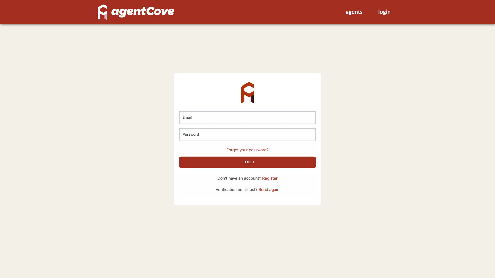
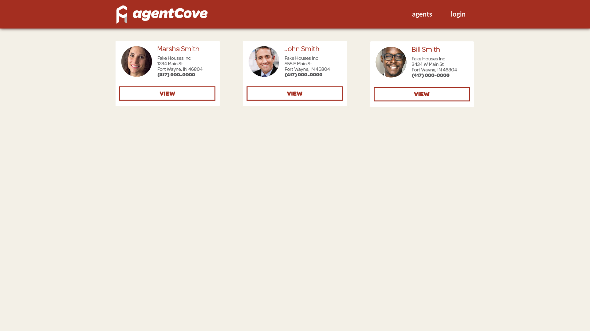
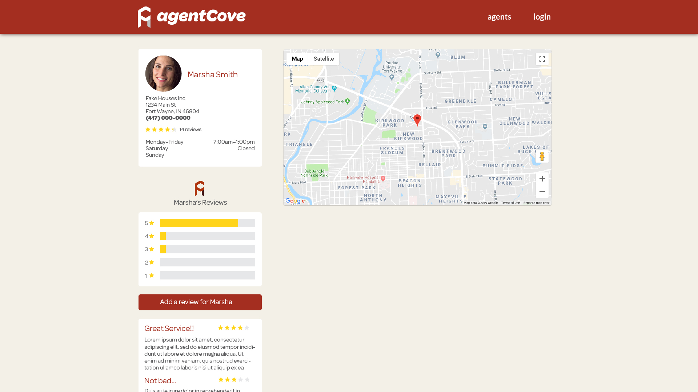
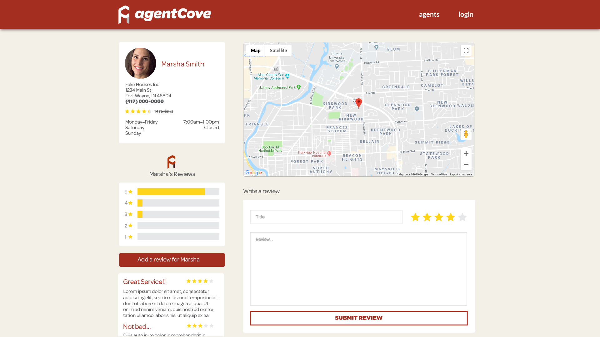

# Developer Challenge Simple Directory

This challenge should take 3-4 hours effort for a expert, 8 hours for someone not familiar with (blaze, bootstrap, router, etc.)

Using [MeteorJS v3](https://www.meteor.com/) with [Blaze](http://blazejs.org/) and provided assets;  create a simple directory application.

[Meteor Documentation](https://docs.meteor.com/)

## Requirements

UX/UI/Visuals must match provided assets.

A user must be able to:

- Register/Login/Logout
- Browse available agents (at least the 3 provided)
- View an agent's profile
- Leave a review and 1-5 star rating
- Login/logout and browse from the header navigation

Note:  Use of libraries is perfectly acceptable. [AtmosphereJS Packages](https://atmospherejs.com/) or [NPM](https://www.npmjs.com/)

Recommended Libraries:
- https://packosphere.com/ostrio/flow-router-extra
- https://atmospherejs.com/meteor/accounts-password
- https://atmospherejs.com/fourseven/scss

## Assets

All visual assets for this project are provided.

- **Font:** [Nunito](https://fonts.google.com/specimen/Nunito)
- **Images:** Located in assets directory

## Views

The visual guide for the 4 required application views.

### 1. Login

A user must be able to register and login.  Password recovery and email verification functionality is not required, but the visual elements should still exist.

### 2. Listings

A user must be able to browse the available agents.  The agent cards should be within a responsive grid.

### 3. Profile

A user must be able to view a list of reviews for an agent.  All other visual elements are required to be present but functionality is optional.

### 4. Add Review

A user must be able to leave a text review and 1-5 star rating for an agent.

